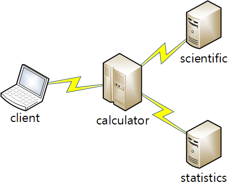
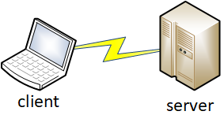
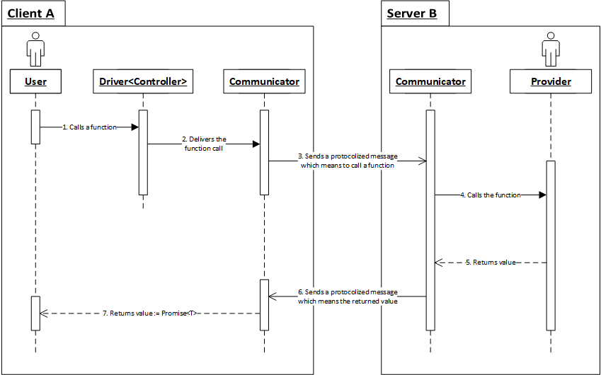

# Basic Concepts
이번 단원에서는 **TGrid** 의 <u>기초 개념</u>에 대하여 알아볼 것입니다. 

이번 단원의 [제 1 장 Theory](#1-theory) 에서는 기초 이론을 배웁니다. **TGrid** 가 주창하는 진정한 Grid Computing 이 무엇이며, *Remote Function Call* 은 어떤 개념인지 알아볼 것입니다. [제 2 장 Components](#2-components) 에서는 TGrid 의 가장 핵심이 되는 기초 컴포넌트들을 익힐 것입니다. 마지막으로 [제 3 장 Protocols](#3-protocols) 에서는 TGrid 가 지원하는 두 가지 프로토콜, *Web Socket* 과 *Workers* 대하여 알아봅니다.

만약, 이 글을 읽으시는 여러분께서 이론보다는 실전을 선호하시며 백 번의 설명보다는 한 번의 코드 읽기를 추구하시는 성향이시라면, 이 단원은 과감히 건너뛰셔도 좋습니다. 이런 분들께는, 바로 이 다음 단원인, [Learn from Examples](examples.md) 부터 읽으시기를 권해드립니다.


## 1. Theory
### 1.1. Grid Computing
그리드 컴퓨팅에 대한 위키백과의 설명은 이러합니다.



https://ko.wikipedia.org/wiki/그리드_컴퓨팅

그리드 컴퓨팅(영어: grid computing)은 최근 활발히 연구가 진행되고 있는 분산 병렬 컴퓨팅의 한 분야로서, 원거리 통신망(WAN, Wide Area Network)으로 연결된 서로 다른 기종의(heterogeneous) 컴퓨터들을 하나로 묶어 가상의 대용량 고성능 컴퓨터(영어: super virtual computer)를 구성하여 고도의 연산 작업(computation intensive jobs) 혹은 대용량 처리(data intensive jobs)를 수행하는 것을 일컫는다. 모든 컴퓨터를 하나의 초고속 네트워크(광통신)로 연결하여 계산능력을 극대화시키는 차세대 디지털 신경망 서비스를 말한다. 여러 컴퓨터를 가상으로 연결해서 공동으로 연산작업을 수행하게 하는 것이며 분산 컴퓨팅이라고도 한다.

그리드는 대용량 데이터에 대한 연산을 작은 소규모 연산들로 나누어 작은 여러대의 컴퓨터들로 분산시켜 수행한다는 점에서 클러스터 컴퓨팅의 확장된 개념으로 볼 수 있으나, WAN 상에서 서로 다른 기종의 머신들을 연결한다는 점으로 인해 클러스터 컴퓨팅에서는 고려되지 않았던 여러 가지 표준 규약들이 필요해졌고, 현재 글로버스(Globus) 프로젝트를 중심으로 표준들이 정립되고 있는 중이다. 또한 다양한 플랫폼을 서로 연결한다는 점에서 클러스터 컴퓨팅과 차이가 있다.



저는 Grid Computing 에 대한 위키백과의 설명 중에, <u>하나의 가상 컴퓨터</u> 라는 단어를 특히 강조하고 싶습니다. 제가 생각하는 Grid Computing 이란, 단순히 여러 대의 컴퓨터를 네트워크로 묶어 공통의 작업을 수행하기만 해서 되는 게 아닙니다. 제가 원하는 진정한 Grid Computing 기술이란, 여러 대의 컴퓨터를 단 한 대의 가상 컴퓨터로 만들어줄 수 있는 것입니다. 

따라서 제 기준에서의 Grid Computing 시스템이란, 그것을 구성하는 컴퓨터가 수백만 대라도, 처음부터 단 한대의 컴퓨터만 있었던 것인냥 개발할 수 있어야 합니다. 단 <u>한 대</u>에서 컴퓨터에서 동작하는 프로그램과, <u>수백만 대</u>를 이용한 분산병렬처리시스템이 모두 <u>동일한 프로그램 코드</u>를 사용할 수 있어야, 그것이 진정 Grid Computing 입니다.

여러분도 그렇게 생각하시나요?

### 1.2. Remote Function Call


제가 생각하는 진정한 Grid Computing 이란, 여러 대의 컴퓨터를 하나의 가상 컴퓨터로 만드는 것입니다. 그리고 Grid Computing 으로 만든 가상 컴퓨터에 탑재될 프로그램의 코드는, 실제로 하나의 컴퓨터에서 동작하는 프로그램의 코드와 동일해야 합니다.

**TGrid** 가, 바로 이 진정한 Grid Computing 을 실현하기 위하여, 제공하는 솔루션은 `Remote Function Call` 입니다. `Remote Function Call` 은 문자 그대로 원격 시스템의 함수를 호출한다는 뜻입니다. `Remote Function Call` 을 이용하면 여러분은 원격 시스템이 가진 객체를 마치 내 메모리 객체인 양 사용하실 수 있습니다. 원격 시스템에 정의된 함수가 마치 내 프로그램의 함수인 양 호출할 수 있구요.

**TGrid** 와 `Remote Function Call` 을 이용하면 원격 시스템의 객체와 함수를 마치 내 것인양 사용할 수 있다, 이 문장이 무엇을 의미할까요? 맞습니다, 원격 시스템의 객체와 함수를 직접 호출할 수 있다는 것은 곧, 현 시스템과 원격 시스템이 <u>하나의 가상 컴퓨터로 통합</u>되었다는 것을 의미합니다. 하나의 컴퓨터에 탑재된 <u>단일 프로그램</u>이니까, 객체간 함수도 호출할 수 있고 뭐 그런 것 아니겠습니까?

### 1.3. Demonstration
이 앞 절에서 저는 **TGrid** 와 [Remote Function Call](#12-remote-function-call) 울 이용하면 여러 대의 컴퓨터를 하나의 가상 컴퓨터로 만들 수 있다고 하였습니다. 그리고 이렇게 만든 가상 컴퓨터의 프로그램 코드는 실제 단일 컴퓨터로 만든 프로그램의 코드와 동일하다고도 하였구요. 

때문에 이번 절은 [Remote Function Call](#12-remote-function-call) 이 정말로 그러한지, 여러 대의 컴퓨터를 하나의 가상 컴퓨터로 만들어줄 수 있는지, 간략한 증명을 해 보일 것입니다. 더불어 [Remote Function Call](#12-remote-function-call) 을 사용하는 코드는 실제로 어떻게 생겨먹었는지도 미리 한 번 봐 두어야지 않겠습니까?

 |  | 
:-----------:|:---------:|:------:
Hierarchical | Composite | Single

아래의 세 예제 코드는 모두 [2.2. Learn from Examples](examples.md) 단원에서 다루는 내용입니다. 아래 예제 코드에 대한 자세한 설명은 해당 단원을 참고해주세요. 지금 우리는 딱 하나만 집중해서 보고자 합니다. 그것은 바로 세 프로젝트의 <u>비지니스 로직 코드가 모두 동일</u>하다는 것입니다.

만들고자 하는 프로그램이 Grid Computing 으로 만들어졌던, 혹은 단일 컴퓨터에서 동작하는 것이던, 비지니스 로직 코드에는 일절 변화가 없습니다. 심지어 Grid Computing 을 구성하는 컴퓨터가 2 대이던 혹은 4 대이던, 여전히 비지니스 로직 코드에는 아무런 변화가 없습니다. 왜냐하면 이들은 모두 하나의 (가상) 컴퓨터로 통합된 상태니까요. 하나의 컴퓨터에 완전히 똑같은 용도의 프로그램을 세 벌 만드는데, 이들의 코드가 어찌 같이 않을 수 있겠나요?

마지막으로 이 말과 함께 이번 장을 마치겠습니다. This is **TGrid**. This is [Remote Function Call](#12-remote-function-call).


```typescript::Hierarchical
<!-- @import("https://raw.githubusercontent.com/samchon/tgrid.examples/master/src/projects/hierarchical-calculator/index.ts") -->
```
```typescript::Composite
<!-- @import("https://raw.githubusercontent.com/samchon/tgrid.examples/master/src/projects/composite-calculator/client.ts") -->
```
```typescript::Single
<!-- @import("https://raw.githubusercontent.com/samchon/tgrid.examples/master/src/projects/composite-calculator/single.ts") -->
```


> ```python
> 1 + 6 = 7
> 7 * 2 = 14
> 3 ^ 4 = 81
> log (2, 32) = 5
> SQRT (-4) -> Error: Negative value on sqaure.
> Mean (1, 2, 3, 4) = 2.5
> Stdev. (1, 2, 3, 4) = 1.118033988749895
> ```


## 2. Components


> ```typescript
> // ACCESS FROM NAMESPACES
> import tgrid = require("tgrid");
> 
> let communicator: tgrid.components.Communicator;
> let driver: tgrid.components.Driver<Controller>;
> 
> // IMPORT FROM MODULE
> import { Communicator, Driver } from "tgrid/components";
> 
> // IMPORT FROM FILES
> import { Communicator } from "tgrid/components/Communicator";
> import { Driver } from "tgrid/components/Driver";
> ```

### 2.1. Communicator
Communicates with Remote System.

`Communicator` 는 원격 시스템과의 네트워크 통신을 전담하는 객체입니다. 이 `Communicator` 에 상대방 시스템에게 제공할 [Provider](#22-provider) 를 등록할 수 있습니다. 상대방 시스템이 제공한 [Provider](#22-provider) 를 사용할 수 있는 [Driver](#24-driver)<[Controller](#23-controller)> 역시, 이 `Communicator` 를 통해 생성할 수 있습니다.

> `Communicator.getDriver<Controller>`

더불어 `Communicator` 는 최상위 추상 클래스로써, **TGrid** 에서 네트워크 통신을 담당하는 클래스들은 모두 이 `Communicator` 클래스를 상속하고 있습니다. 이에 관한 자세한 내용은 [3. Protocols](#3-protocols) 단원을 참고해주세요.


```typescript::Server
import { WebServer } from "tgrid/protocols/web/WebServer";
import { WebAcceptor } from "tgrid/protocols/web/WebAcceptor";
import { Calculator } from "../providers/Calculator";

async function main(): Promise<void>
{
    let server: WebServer = new WebServer();
    let provider: Calculator = new Calculator();

    await server.open(10101, async (acceptor: WebAcceptor) =>
    {
        // PROVIDE CALCULATOR
        await accept.accept(provider);
    });
}
```
```typescript::Client
import { WebConnector } from "tgrid/protocols/web/WebConnector";
import { Driver } from "tgrid/components/Driver";
import { ICalculator } from "../controllers/ICalculator";

async function main(): Promise<void>
{
    //----
    // DO CONNECT
    //----
    let connector: WebConnector = new WebConnector();
    await connector.connect("http://127.0.0.1:10101");

    //----
    // CALL REMOTE FUNCTIONS
    //----
    // GET DRIVER PROVIDED BY SERVER
    let calc: Driver<ICalculator> = connector.getDriver<ICalculator>();

    // FUNCTIONS IN THE ROOT SCOPE
    console.log("1 + 6 =", await calc.plus(1, 6));
    console.log("7 * 2 =", await calc.multiplies(7, 2));

    // FUNCTIONS IN AN OBJECT (SCIENTIFIC)
    console.log("3 ^ 4 =", await calc.scientific.pow(3, 4));
    console.log("log (2, 32) =", await calc.scientific.log(2, 32));

    try
    {
        // TO CATCH EXCEPTION IS ALSO POSSIBLE
        await calc.scientific.sqrt(-4);
    }
    catch (err)
    {
        console.log("SQRT (-4) -> Error:", err.message);
    }

    // FUNCTIONS IN AN OBJECT (STATISTICS)
    console.log("Mean (1, 2, 3, 4) =", await calc.statistics.mean(1, 2, 3, 4));
    console.log("Stdev. (1, 2, 3, 4) =", await calc.statistics.stdev(1, 2, 3, 4));

    //----
    // CLOSE CONNETION
    //----
    await connector.close();
}
```


### 2.2. Provider
Object being provided for Remote System

`Provider` 는 원격 시스템에 제공할 객체입니다. 상대방 시스템은 현 시스템이 `Provider` 로 등록한 객체에 정의된 함수들을, [Driver](#24-driver)<[Controller](#23-controller)> 를 이용해 원격으로 호출할 수 있습니다.

```typescript
export class Calculator
{
    public plus(x: number, y: number): number;
    public minus(x: number, y: number): number;
    public multiplies(x: number, y: number): number;
    public divides(x: number, y: number): number;

    public scientific: Scientific;
    public statistics: Statistics;
}
```

### 2.3. Controller
Interface of [Provider](#22-provider)

`Controller` 는 원격 시스템에서 제공하는 [Provider](#22-provider) 에 대한 인터페이스입니다.

```typescript
export interface ICalculator
{
    plus(x: number, y: number): number;
    minus(x: number, y: number): number;
    multiplies(x: number, y: number): number;
    divides(x: number, y: number): number;

    scientific: IScientific;
    statistics: IStatistics;
}
```

### 2.4. Driver
`Driver` of [Controller](#23-controller) for [Remote Function Call](#12-remote-function-call)

`Driver` 는 원격 시스템의 함수를 호출할 때 사용하는 객체입니다. 제네릭 파라미터로써 [Controller](#23-controller) 를 지정하게 되어있으며, 바로 이 `Driver<Controller>` 객체를 통해, 원격 시스템에서 현 시스템을 위해 제공한 [Provider](#22-provider) 객체의, 함수를 원격 호출할 수 있습니다. 바로 이 `Driver<Controller>` 객체를 통해 이루어진 원격 함수 호출을 일컬어, [Remote Function Call](#12-remote-function-call) 라고 합니다.

더불어 `Driver` 의 제네릭 타입에 [Controller](#23-controller) 를 할당하거든, 해당 [Controller](#23-controller) 에 정의된 모든 함수들의 리턴타입은 *Promise* 화 됩니다. 만약 대상 [Controller](#23-controller) 안에 내부 오브젝트가 정의되어있거든, 해당 오브젝트 역시 `Driver<object>` 타입으로 변환됩니다. 그리고 이는 재귀적으로 반복되기에 최종적으로 [Controller](#23-controller) 에 정의된 함수들은 모두, 그것의 계층 깊이에 상관없이, *Promise* 화 됩니다. 

```typescript
type Driver<ICalculator> = 
{
    plus(x: number, y: number): Promise<number>;
    minus(x: number, y: number): Promise<number>;
    multiplies(x: number, y: number): Promise<number>;
    divides(x: number, y: number): Promise<number>;

    readonly scientific: Driver<IScientific>;
    readonly statistics: Driver<IStatistics>;
};
```



`Driver<Controller>` 에서는 원자 변수 (*number* 나 *string* 등) 가 무시됩니다.

아래 예제 코드에서 보실 수 있다시피, [Controller](#23-controller) 에 정의된 원자 변수들은 `Driver<Controller>` 에서 모두 사라지게 됩니다. 따라서 [Provider](#22-provider) 를 설계하실 때, 원격 시스템에게 원자 변수를 제공하시려거든, 아래 예제코드와 같이 *getter* 또는 *setter* 메서드를 정의하셔야 합니다.

  - *Something.getValue()*
  - *Something.setValue()*

```typescript
interface ISomething
{
    getValue(): number;
    setValue(val: number): void;

    value: number;
}

type Driver<ISomething> = 
{
    getValue(): Promise<number>;
    setValue(val: number): Promise<void>;
};
```



## 3. Protocols
### 3.1. Web Socket
> ```typescript
> // ACCESS FROM NAMESPACES
> import tgrid = require("tgrid");
> 
> let server: tgrid.protocols.web.WebServer;
> let acceptor: tgrid.protocols.web.WebAcceptor;
> 
> // IMPORT FROM MODULE
> import { WebServer, WebAcceptor } from "tgrid/protocols/web";
> 
> // IMPORT FROM FILES
> import { WebServer } from "tgrid/protocols/web/Communicator";
> import { WebAcceptor } from "tgrid/protocols/web/Driver";
> ```

#### 3.1.1. Outline
**TGrid** 는 웹소켓 프로토콜을 지원합니다.

#### 3.1.2. Tutorials
아래 리스트는 **TGrid** 에서 웹 소켓 프로토콜을 이용하여 만든 예제 코드와 데모 프로젝트입니다. **TGrid** 는 Web Socket 모듈의 세부 컴포넌트들에 대하여 [API 문서](#313-module)도 제공하지만, 아래 예제 코드와 데모 프로젝트들을 함께 보시면 훨씬 더 유익할 것입니다.

  - 예제 코드
    - [Remote Function Call](examples.md#1-remote-function-call)
    - [Remote Object Call](examples.md#2-remote-object-call)
  - 데모 프로젝트
    - [Chat Application](projects/chat-application.md)
    - [Omok Game](projects/omok-game.md)
    - [Grid Market](projects/grid-market.md)

#### 3.1.3. Module
 Class           | Web Browser | NodeJS | Usage
-----------------|-------------|--------|---------------------------
[WebServer](https://tgrid.dev/api/classes/tgrid_protocols_web.webserver.html)    | X           | O      | 웹소켓 서버 개설
[WebAcceptor](https://tgrid.dev/api/classes/tgrid_protocols_web.webacceptor.html)  | X           | O      | 클라이언트와의 [RFC](#12-remote-function-call) 통신 담당
[WebConnector](https://tgrid.dev/api/classes/tgrid_protocols_web.webconnector.html) | O           | O      | 웹소켓 서버로 접속하여 [RFC](#12-remote-function-call) 통신

**TGrid** 의 `protocols.web` 모듈에는 이처럼 딱 3 개의 클래스만이 존재합니다. 제일 먼저 웹소켓 서버를 개설하는 데 필요한 [WebServer](https://tgrid.dev/api/classes/tgrid_protocols_web.webserver.html) 클래스가 있으며, 웹소켓 서버에 접속한 각 클라이언트와의 [RFC](#12-remote-function-call) 통신을 담당하는 [WebAcceptor](https://tgrid.dev/api/classes/tgrid_protocols_web.webacceptor.html) 클래스가 있습니다. 그리고 마지막으로 클라이언트에서 웹소켓 서버에 접속할 때 사용하는 [WebConnector](https://tgrid.dev/api/classes/tgrid_protocols_web.webconnector.html) 클래스가 있습니다.

이 중에 [Communicator](#21-communicator) 클래스는 [WebAcceptor](https://tgrid.dev/api/classes/tgrid_protocols_web.webacceptor.html) 와 [WebConnector](https://tgrid.dev/api/classes/tgrid_protocols_web.webconnector.html) 클래스입니다. [WebServer](https://tgrid.dev/api/classes/tgrid_protocols_web.webserver.html) 는 분명 웹소켓 서버를 개설할 수 있고 클라이언트가 접속할 때마다 매번 [WebAcceptor](https://tgrid.dev/api/classes/tgrid_protocols_web.webacceptor.html) 오브젝트를 새로이 생성해주기는 하지만, [Communicator](#21-communicator) 클래스는 결코 아닙니다.

더불어 주의하셔야 할 게 하나 있습니다. 웹 브라우저는 스스로 웹소켓 서버를 개설할 수 없으며, 오로지 클라이언트의 역할만을 수행할 수 있다는 것입니다. 따라서 **TGrid** 를 이용하여 웹 어플리케이션을 만드실 경우, 오직 [WebConnector](https://tgrid.dev/api/classes/tgrid_protocols_web.webconnector.html) 클래스만을 사용할 수 있습니다.

### 3.2. Workers
> ```typescript
> // ACCESS FROM NAMESPACES
> import tgrid = require("tgrid");
> 
> let server: tgrid.protocols.workers.WorkerServer;
> let connector: tgrid.protocols.workers.WorkerConnector;
> 
> // IMPORT FROM MODULE
> import { WorkerServer, WorkerConnector } from "tgrid/protocols/workers";
> 
> // IMPORT FROM FILES
> import { WorkerServer } from "tgrid/protocols/workers/WorkerServer";
> import { WorkerConnector } from "tgrid/protocols/workers/WorkerConnector";
> ```

#### 3.2.1. Outline
**TGrid** 는 *Worker* 및 *SharedWorker* 프로토콜을 지원합니다.




*Worker* 는 웹 브라우저에서 멀티 스레딩을 지원하기 위하여 창안된 개념입니다. 하지만, 일반적인 프로그램의 스레드와는 달리, *Worker* 는 메모리 변수를 공유할 수 없습니다. 표준적인 스레드 모델과는 달리 메모리 변수를 공유할 수 없는 *Worker* 이기에, 웹 브라우저와 Worker 간의 연동 (또는 *Worker* 인스턴스들 간의 상호 연동) 은 오로지 [MessageChannel](https://developer.mozilla.org/en-US/docs/Web/API/MessageChannel) 을 통해 바이너리 데이터를 송수신하는 방식으로밖에 구현할 수 없습니다.

인스턴스간에 연동을 꾀함에 있어 메모리 변수를 공유하는게 아니라, 상호간 바이너리 데이터를 송수신한다구요? 이거 어디서 많이 듣던 이야기 아닌가요? 맞습니다, 네트워크 통신을 이용한 분산처리시스템의 가장 전형적인 모습입니다. 즉, *Worker* 가 사용하는 [MessageChannel](https://developer.mozilla.org/en-US/docs/Web/API/MessageChannel) 은 개념적으로 <u>Network Communication</u> 과 완전히 일치합니다.

다시 한 번 정리하자면, Worker 는 물리적으로는 스레드 레벨에서 생성되는 인스턴스이나, 그 원리나 작동되는 방식으로 보건데 개념적으로는 한없이 네트워크 시스템에 가깝습니다. 저는 바로 이 부분에 주목하여 *Worker* 도 Network Protocol 의 일종으로 해석하고 간주하였습니다. 따라서 **TGrid** 는 Worker Protocol 에 대하여도 [Remote Function Call](#12-remote-function-call) 을 지원합니다.



#### 3.2.2. Tutorials
아래 리스트는 **TGrid** 에서 Worker 프로토콜을 이용하여 만든 예제 코드와 데모 프로젝트입니다. **TGrid** 는 Workers 모듈의 세부 컴포넌트들에 대하여 [API 문서](#323-module)도 제공하지만, 아래 예제 코드와 데모 프로젝트들을 함께 보시면 훨씬 더 유익할 것입니다.

  - 예제 코드
    - [Object Oriented Network](examples.md#3-object-oriented-network)
    - [Remote Critical Section](examples.md#4-remote-critical-section)
  - 데모 프로젝트
    - [Grid Market](projects/grid-market.md)

#### 3.2.3. Module
 Class                    | Web Browser | NodeJS | Usage
--------------------------|-------------|--------|---------------------------
[WorkerConnector](https://tgrid.dev/api/classes/tgrid_protocols_workers.workerconnector.html)       | O           | O      | Worker 를 생성하고 이에 접속하여 [RFC](#12-remote-function-call) 통신
[WorkerServer](https://tgrid.dev/api/classes/tgrid_protocols_workers.workerserver.html)          | O           | O      | Worker 그 자체. 클라이언트와 [RFC](#12-remote-function-call) 통신
[SharedWorkerConnector](https://tgrid.dev/api/classes/tgrid_protocols_workers.sharedworkerconnector.html) | O           | X      | SharedWorker 에 접속하여 [RFC](#12-remote-function-call) 통신
[SharedWorkerServer](https://tgrid.dev/api/classes/tgrid_protocols_workers.sharedworkerserver.html)    | O           | X      | SharedWorker 그 자체, 서버 개설
[SharedWorkerAcceptor](https://tgrid.dev/api/classes/tgrid_protocols_workers.sharedworkeracceptor.html)  | O           | X      | 클라이언트와의 [RFC](#12-remote-function-call) 통신을 담당

**TGrid** 의 `protocols.workers` 모듈에 속한 클래스들은 크게 두 가지 주제로 나눌 수 있습니다. 첫 번째 주제는 *Worker* 이고, 두 번째 주제는 *SharedWorker* 입니다. 이 둘의 가장 핵심되는 차이점은 *Worker*  는 서버와 클라이언트의 대수관계가 1:1 이고, *SharedWorker* 는 1:N 이라는 것입니다.

[WorkerConnector](https://tgrid.dev/api/classes/tgrid_protocols_workers.workerconnector.html) 는 *Worker* 인스턴스를 생성하고, 해당 *Worker* 인스턴스가 개설한 [WorkerServer](https://tgrid.dev/api/classes/tgrid_protocols_workers.workerserver.html) 에 접속하여 [RFC](#12-remote-function-call) 통신을 행할 수 있습니다. 그리고 [WorkerServer](https://tgrid.dev/api/classes/tgrid_protocols_workers.workerserver.html) 는 그 고유한 특성상, 오로지 단 하나의 클라이언트만을 상대할 수 있습니다. 때문에 [WorkerServer](https://tgrid.dev/api/classes/tgrid_protocols_workers.workerserver.html) 다른 여타 서버 클래스들과는 달리, 그 스스로가 [Communicator](#21-communicator) 클래스로써, 클라이언트 프로그램과 직접 [RFC](#12-remote-function-call) 통신을 수행합니다.

  - [WorkerConnector](https://tgrid.dev/api/classes/tgrid_protocols_workers.workerconnector.html) creates a new *Worker* instance
  - The new *Worker* instance opens WorkerServer
  - [WorkerConnector](https://tgrid.dev/api/classes/tgrid_protocols_workers.workerconnector.html) and [WorkerServer](https://tgrid.dev/api/classes/tgrid_protocols_workers.workerserver.html) interact with [RFC](#12-remote-function-call)

[SharedWorkerConnector](https://tgrid.dev/api/classes/tgrid_protocols_workers.sharedworkerconnector.html) 의 경우에는 좀 특이합니다. 지정된 파일 경로를 따라 *SharedWorker* 인스턴스를 생성하기도 하고, 먼저 생성된 *SharedWorker* 인스턴스가 존재하거든 기존의 것을 사용하기도 합니다. 어쨋든 [SharedWorkerServer](https://tgrid.dev/api/classes/tgrid_protocols_workers.sharedworkerserver.html) 는, 이러한 고유 특성 덕분에, 여러 클라이언트의 접속을 동시에 받아낼 수 있습니다. 따라서 *SharedWorker* 의 경우에는 앞서 [웹소켓](#31-web-socket) 때와 마찬가지로, 상호간 [RFC](#12-remote-function-call) 통신을 담당하는 [Communicator](#21-communicator) 클래스는 [SharedWorkerConnector](https://tgrid.dev/api/classes/tgrid_protocols_workers.sharedworkerconnector.html) 와 [SharedWorkerAcceptor](https://tgrid.dev/api/classes/tgrid_protocols_workers.sharedworkeracceptor.html) 입니다.

  - [SharedWorkerConnector](https://tgrid.dev/api/classes/tgrid_protocols_workers.sharedworkerconnector.html) creates a new or brings an existing *SharedWorker* instance.
  - The *SharedWorker* instance opens [SharedWorkerServer](https://tgrid.dev/api/classes/tgrid_protocols_workers.sharedworkerserver.html) if newly created.
  - [SharedWorkerAcceptor](https://tgrid.dev/api/classes/tgrid_protocols_workers.sharedworkeracceptor.html) and [SharedWorkerConnector](https://tgrid.dev/api/classes/tgrid_protocols_workers.sharedworkerconnector.html) interact with [RFC](#12-remote-function-call)



*SharedWorker* 는 오로지 웹 브라우저만이 지원하는 기술로써, NodeJS 에서는 이를 사용할 수 없습니다. 

하지만, 이 *SharedWorker* 라는 기술도 사용하기에 따라서는 매우 강력한 무기가 될 수 있습니다. 제 생각에 NodeJS 로 웹소켓 서버를 실제 구현할 때, 사전 테스트 및 시뮬레이션 용도로 이 *SharedWorker* 만큼 제격인 게 또 어디 있을까 싶습니다. 또한 NodeJS 로 프로그램을 만들다보면, 공통 백그라운드 프로세스가 절실히 필요할 때가 종종 있습니다. 그 때에도 역시 도통 *SharedWorker* 만한게 없습니다.

이에 본인은 NodeJS 에서 *SharedWorker* 를 사용할 수 있는 `polyfill` 라이브러리를 제작해 볼 생각입니다. 하지만, 저는 아직 이를 어떻게 구현해야 하는 지 모릅니다. 혹 이 글을 읽는 분들 중에 *SharedWorker* 의 `polyfill` 라이브러리를 구현할 수 있다거나, 구현할 수 있는 방법을 아는 분이 계시다면, 꼭 좀 도와주시기 바랍니다.

  - https://github.com/samchon/tgrid/issues

